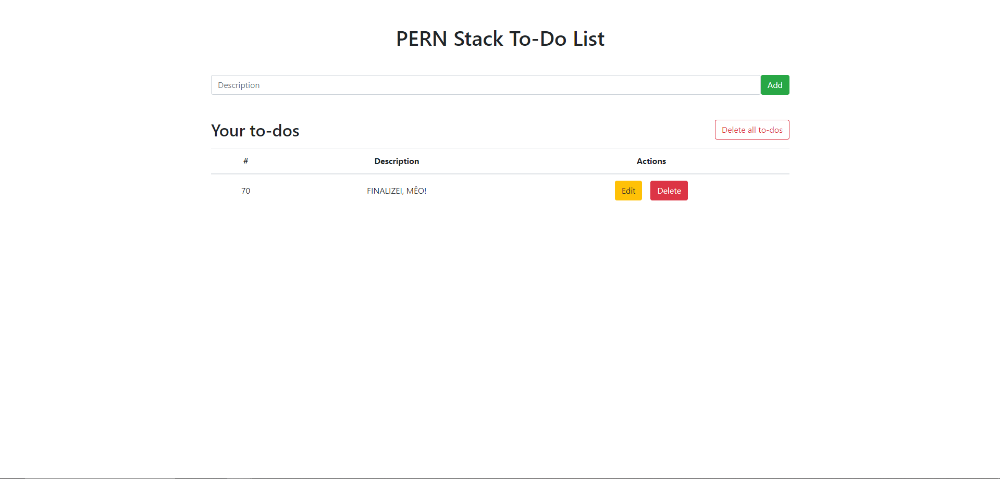
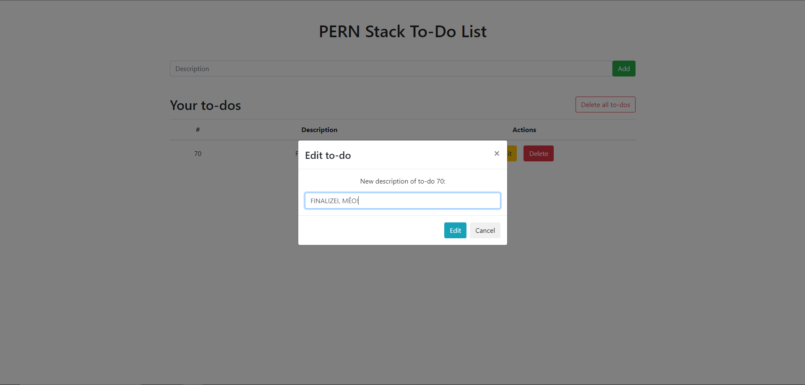

# PERN-Stack-To-do-List
CRUD project using the PERN Stack (consisting of PostgreSQL, Express.JS, React and Node.js) based on said [tutorial](https://www.youtube.com/watch?v=ldYcgPKEZC8).

**Screenshots for demonstration**:

# 
